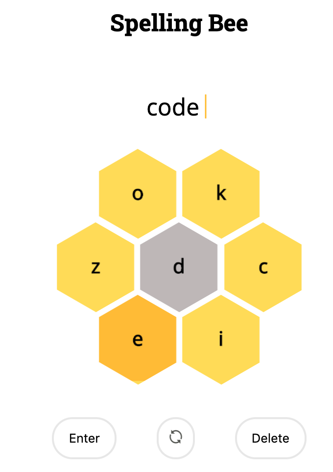

# spelling_bee

### Project Origin
This project is based off of NYT's [Spelling Bee Puzzles](https://www.nytimes.com/puzzles/spelling-bee).
 You must have NYT puzzle membership to play the game 
 Sabrina and I loved playing this game so much that we decided to build it for ourselves. 

Here is an example of what it looks like:

###  References: 

Code for hexagonal grid derived from here: https://github.com/web-tiki/responsive-grid-of-hexagons

Raw Dictionary of English words: https://github.com/dwyl/english-words

